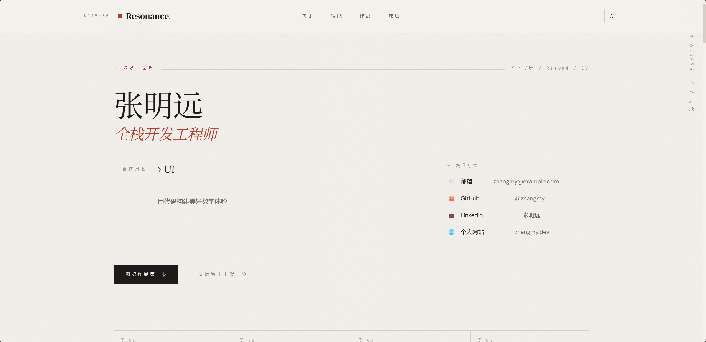
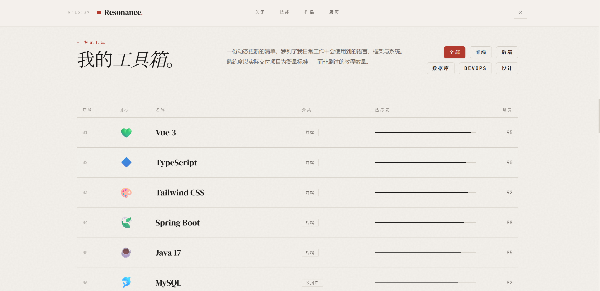
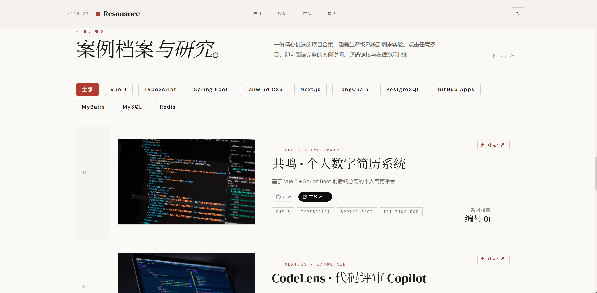
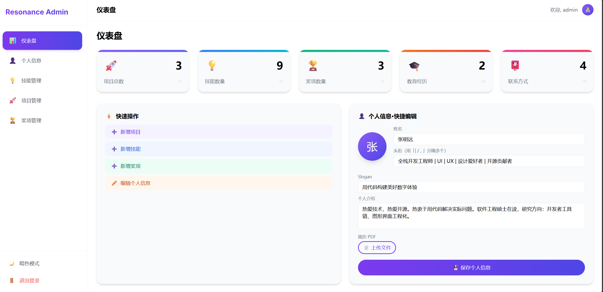
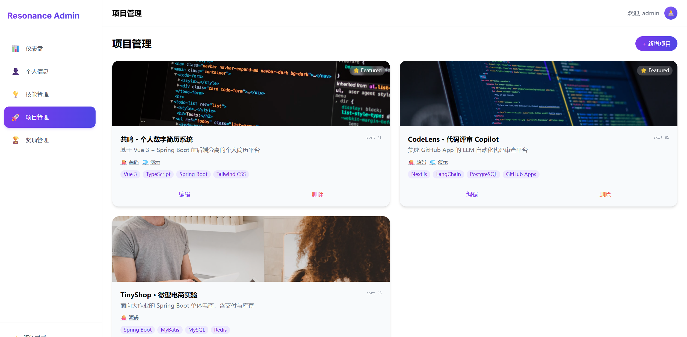
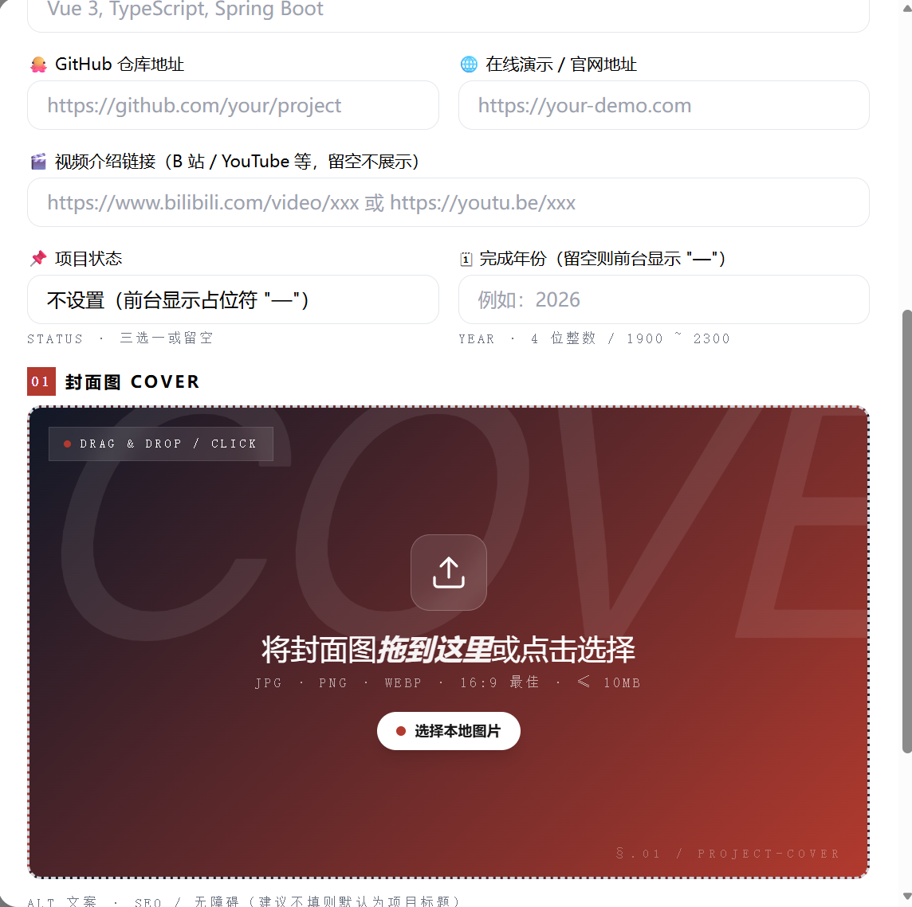
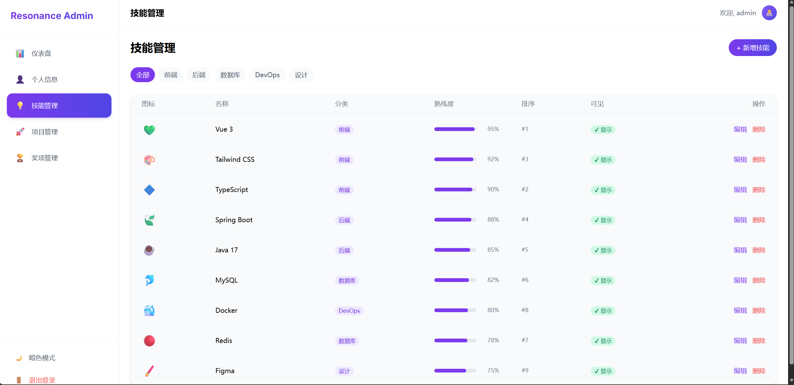
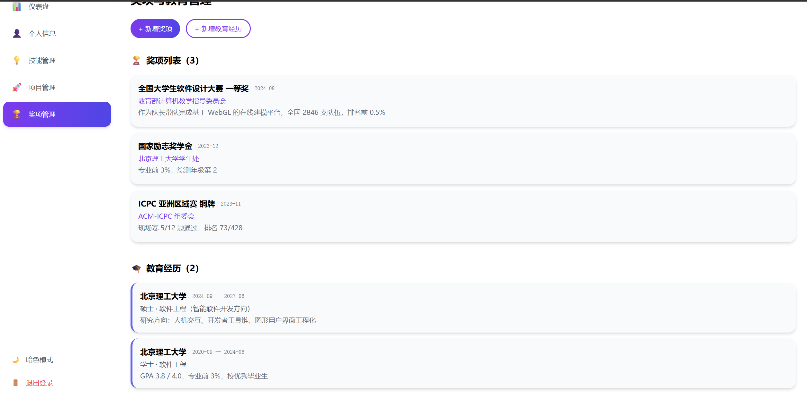

# 共鸣 Resonance · 全栈个人品牌数字简历系统

> 一个前后端分离的全栈个人作品集/数字简历系统，包含前台品牌展示站与后台内容管理系统。

---

## 目录

- [项目概述](#项目概述)
- [界面预览](#界面预览)
- [核心功能](#核心功能)
- [技术栈](#技术栈)
- [项目结构](#项目结构)
- [数据模型](#数据模型)
- [快速开始](#快速开始)
- [API 接口说明](#api-接口说明)
- [部署指南](#部署指南)
- [常见问题 FAQ](#常见问题-faq)
- [配置说明](#配置说明)

---

## 项目概述

**共鸣 Resonance** 是一套面向个人品牌建设的全栈数字简历解决方案。系统采用「三端分离」架构：

| 模块 | 说明 | 默认端口 |
| :-- | :-- | :-- |
| **hr-web** | 前台品牌展示站（访客访问的作品集官网） | `5173` |
| **admin-web** | 后台内容管理系统（编辑简历、项目、奖项等内容） | `5174` |
| **api** | Spring Boot 后端 RESTful API 服务 | `8080` |

### 设计理念

- **Swiss Grid 排版**：前台采用 12 栏瑞士网格布局，配合大量留白与 1px 分割线，呈现杂志级视觉质感
- **极简配色**：定制 Tailwind 调色板 — Paper White `#F4F1EC`、Cinnabar Red `#B23A2E`、Forest Green `#2F4538`
- **衬线+无衬线混排**：标题使用 DM Serif Display / Lora，正文 DM Sans，代码 JetBrains Mono
- **SVG 纸质纹理**：用 SVG 纹理与轻网格背景替代渐变，保证独特的视觉识别度

---

## 界面预览

### 前台品牌展示站 (hr-web)

| 首页（Hero + 首屏） | 技能矩阵 + 工具箱 |
| :--: | :--: |
|  |  |
| 首屏展示姓名、头衔轮播、Slogan、头像与简历下载入口 | 按分类分组的技能进度条，熟练度百分比可视化 |

| 案例档案与研究（卡片列表） | 项目详情弹窗（12 栏 Grid） |
| :--: | :--: |
|  | *点击卡片后弹出详情（含状态、完成年份、详细描述 italic 衬线正文、多图横滑）* |

---

### 后台内容管理系统 (admin-web)

| 仪表盘总览 | 项目管理（卡片列表 + 搜索/标签筛选） |
| :--: | :--: |
|  |  |
| 项目/技能/奖项/教育数量统计 + 快捷入口 | 列表展示：封面、状态 badge、完成年份、精选★/发布✓开关 |

| 项目编辑窗口（12 栏表单） | 技能管理（分类+熟练度滑块） |
| :--: | :--: |
|  |  |
| 状态三选一（已上线/筹备中/规划中）+ 完成年份手输 + 多图拖拽排序 | 分类自动创建、重名校验、显示/隐藏切换 |

| 奖项与荣誉管理 |
| :--: |
|  |
| 奖项名称/颁发机构/日期 + 证书与封面双上传 |

---

## 核心功能

### 前台展示站 (hr-web)

| 模块 | 说明 |
| :-- | :-- |
| **Hero 首屏** | 姓名、头衔轮播、Slogan 标语、头像与简历下载按钮 |
| **关于我 (About)** | 个人简介 Bio、从业年限、所在城市、专注方向/服务模块 4 卡片 |
| **技能矩阵 (Skills)** | 按分类分组的技能列表（熟练度百分比可视化） |
| **案例档案与研究 (Projects)** | 精选项目卡片网格 · 点击弹窗查看详情（含多图轮播、标签、状态、完成年份、详细描述） |
| **时间线 (Timeline)** | 教育经历 + 获奖荣誉按时间倒序排列 |
| **页脚 (Footer)** | 联系方式卡片（可复制/可跳转链接） |

### 后台管理端 (admin-web)

| 模块 | 说明 |
| :-- | :-- |
| **登录/注册** | 首次启动自动引导注册管理员，JWT 会话有效期 7 天 |
| **仪表盘 (Dashboard)** | 数据总览：项目数、技能数、奖项数、教育数等统计 |
| **个人信息 (Profile)** | 编辑姓名/头衔/Slogan/Bio/头像/简历/专注方向/合作模式/联系方式 |
| **技能管理 (Skills)** | 技能增删改、分类、排序、熟练度、显示/隐藏切换 |
| **项目管理 (Projects)** | 项目增删改、多图上传、标签、状态（已上线/筹备中/规划中）、完成年份、精选/发布、排序 |
| **奖项管理 (Awards)** | 奖项名称/颁发机构/日期/描述/证书图/封面图 |
| **教育管理 (Education)** | 学校/学位/专业/起止日期/描述 |

---

## 技术栈

### 后端 (api)

```
Spring Boot 3.2.7     ← 核心框架
├── Spring Security    ← 认证与鉴权
├── JWT (JJWT 0.12.5)  ← 无状态令牌签发
├── Spring Data JPA    ← ORM 数据访问
├── Hibernate          ← 持久化实现
├── MySQL 8.x          ← 主数据库（生产/开发）
├── H2 Database        ← 嵌入式数据库（无 MySQL 时快速调试）
├── Validation (JSR-380) ← 请求参数校验
├── Lombok             ← 消除样板代码
└── Jackson            ← JSON 序列化
```

### 前端 (hr-web / admin-web)

```
Vue 3.5.39            ← 渐进式框架（Composition API + <script setup>）
├── TypeScript 6.0     ← 类型系统
├── Pinia 4.x          ← 状态管理
├── Vue Router 4.6     ← SPA 路由
├── Vite 8.x           ← 构建工具与开发服务器
├── Tailwind CSS 3.4   ← 原子化 CSS 框架（定制调色板与字体栈）
├── @vueuse/core 14    ← Vue 组合式工具集
└── PostCSS + Autoprefixer
```

### 构建与打包

- **后端**：Maven → 可执行 JAR（`resonance-api.jar`，内嵌 Tomcat）
- **前端**：Vite → 静态资源目录（`dist/`，需 Nginx 或静态服务器部署）
- **JDK 版本**：OpenJDK / OracleJDK **17**（Spring Boot 3.x 强制要求）

---

## 项目结构

```
jianli/
├── api/                              # Spring Boot 后端
│   ├── pom.xml                       # Maven 依赖管理
│   ├── data/                         # H2 数据库文件（开发）
│   ├── docs/                         # SQL 脚本（schema.sql / schema-demo.sql）
│   ├── uploads/                      # 本地上传文件目录（自动创建）
│   │   └── upload/2026/07/*.{pdf,png,jpg}
│   └── src/main/
│       ├── java/com/zhangmy/resonance/
│       │   ├── ResonanceApplication.java      # 启动类
│       │   ├── common/                        # 通用组件
│       │   │   ├── R.java                     # 统一响应封装
│       │   │   ├── BizException.java          # 业务异常
│       │   │   ├── ErrorCode.java             # 错误码枚举
│       │   │   ├── GlobalExceptionHandler.java# 全局异常处理
│       │   │   └── JwtUtils.java              # JWT 签发/校验
│       │   ├── config/                        # 配置类
│       │   │   ├── SecurityConfig.java        # Spring Security 配置
│       │   │   ├── WebMvcConfig.java          # CORS / 静态资源映射
│       │   │   ├── JacksonConfig.java         # JSON 序列化配置
│       │   │   ├── StorageProperties.java     # 文件上传配置
│       │   │   └── security/                  # 鉴权相关
│       │   │       ├── AdminPrincipal.java
│       │   │       ├── CurrentAdmin.java
│       │   │       └── JwtAuthenticationFilter.java
│       │   └── modules/                       # 业务模块
│       │       ├── auth/                      # 认证（登录/注册/状态）
│       │       ├── dashboard/                 # 仪表盘统计
│       │       ├── entity/                    # 8 个 JPA 实体类
│       │       ├── profile/                   # 个人资料 CRUD
│       │       ├── project/                   # 项目 CRUD
│       │       ├── skill/                     # 技能 CRUD
│       │       ├── timeline/                  # 奖项 + 教育 CRUD
│       │       ├── pub/                       # 前台公开聚合接口
│       │       ├── upload/                    # 文件上传
│       │       └── repo/                      # Spring Data JPA Repository
│       └── resources/
│           └── application.yml                # 多环境配置（dev/prod）
│
├── hr-web/                           # 前台品牌展示站
│   ├── package.json
│   ├── vite.config.ts
│   ├── tailwind.config.js
│   └── src/
│       ├── api/index.ts              # API 请求封装
│       ├── router/index.ts           # 路由配置
│       ├── stores/                   # Pinia 状态（app / theme）
│       ├── types/index.ts            # 全局 TypeScript 类型
│       ├── composables/index.ts      # 组合式函数
│       └── views/front/
│           ├── FrontLayout.vue       # 前台布局（导航栏 + 页脚）
│           ├── HomeView.vue          # 首页（聚合所有 Section）
│           ├── NavBar.vue            # 顶部导航
│           ├── HeroSection.vue       # 首屏
│           ├── AboutSection.vue      # 关于我
│           ├── SkillSection.vue      # 技能矩阵
│           ├── ProjectSection.vue    # 案例档案与研究（含详情弹窗）
│           ├── TimelineSection.vue   # 教育/奖项时间线
│           └── FooterSection.vue     # 联系方式
│
├── admin-web/                        # 后台管理系统
│   ├── package.json
│   ├── vite.config.ts
│   ├── tailwind.config.js
│   └── src/
│       ├── api/index.ts              # API 请求封装（带 JWT 拦截）
│       ├── router/index.ts           # 路由 + 登录守卫
│       ├── stores/                   # Pinia 状态（app / auth / theme）
│       ├── types/index.ts
│       └── views/admin/
│           ├── AdminLayout.vue       # 后台布局（侧边栏 + 内容区）
│           ├── LoginView.vue         # 登录页
│           ├── RegisterView.vue      # 首次注册引导页
│           ├── DashboardView.vue     # 仪表盘
│           ├── ProfileEditView.vue   # 个人信息编辑
│           ├── SkillsView.vue        # 技能管理
│           ├── ProjectsView.vue      # 项目管理（含编辑弹窗）
│           └── AwardsView.vue        # 奖项 + 教育管理
│
└── 共鸣.zip / 源码.zip               # 构建产物（见打包说明）
```

---

## 数据模型

系统共 8 张核心表，均以单管理员 `admin_id` 做数据隔离：

### 1. admin_user（管理员用户表）
| 字段 | 类型 | 说明 |
| :-- | :-- | :-- |
| id | BIGINT PK | 主键 |
| username | VARCHAR(64) UNIQUE | 登录用户名 |
| password_hash | VARCHAR(255) | BCrypt 哈希密码 |
| display_name | VARCHAR(64) | 显示名称 |
| avatar_url | VARCHAR(512) | 头像 URL |
| last_login_at | DATETIME | 最近登录时间 |

### 2. profile（个人资料表，1:1 对应 admin_user）
| 字段 | 类型 | 说明 |
| :-- | :-- | :-- |
| id | BIGINT PK | 主键 |
| admin_id | BIGINT UNIQUE FK | 关联管理员 |
| name | VARCHAR(64) | 姓名 |
| titles_json | JSON | 头衔数组（如：["产品设计师","独立开发者"]） |
| slogan | VARCHAR(200) | 标语 |
| bio | MEDIUMTEXT | 个人简介（长文） |
| location | VARCHAR(128) | 所在城市 |
| years_experience | INT | 从业年限 |
| focus_areas_json | JSON | 专注方向/服务模块数组 |
| working_mode | VARCHAR(128) | 合作模式（远程/驻场/咨询） |
| avatar_url | VARCHAR(512) | 头像 |
| resume_url | VARCHAR(512) | 简历文件 URL（PDF/图片） |

### 3. skill（技能表）
| 字段 | 类型 | 说明 |
| :-- | :-- | :-- |
| id | BIGINT PK | 主键 |
| admin_id | BIGINT FK | 所属管理员 |
| name | VARCHAR(64) | 技能名（同管理员唯一名） |
| category | VARCHAR(32) | 分类（如 设计/前端/后端/工具） |
| icon | VARCHAR(64) | 图标标识 |
| proficiency | INT | 熟练度 0-100 |
| sort_order | INT | 排序（越小越靠前） |
| is_visible | BOOLEAN | 前台是否显示 |

### 4. project（项目表）
| 字段 | 类型 | 说明 |
| :-- | :-- | :-- |
| id | BIGINT PK | 主键 |
| admin_id | BIGINT FK | 所属管理员 |
| title | VARCHAR(200) | 项目名称 |
| summary | VARCHAR(500) | 卡片摘要 |
| description_ | MEDIUMTEXT | 详细描述（前台详情 italic 大段正文） |
| tags_json | JSON | 标签数组 |
| status_ | ENUM | 状态：`ONLINE` 已上线 / `PREPARING` 筹备中 / `PLANNING` 规划中 |
| completion_year | INT | 完成年份（4 位数字，手动输入） |
| github_url | VARCHAR(512) | GitHub 仓库链接 |
| demo_url | VARCHAR(512) | 演示站链接 |
| video_url | VARCHAR(512) | 视频链接 |
| is_featured | BOOLEAN | 精选标记 |
| is_published | BOOLEAN | 发布状态 |
| sort_order | INT | 排序 |

> 项目图片由 **project_image** 表单独存储（1:N），支持排序、alt 文本。

### 5. project_image（项目图片表）
| 字段 | 类型 | 说明 |
| :-- | :-- | :-- |
| id | BIGINT PK | 主键 |
| project_id | BIGINT FK | 所属项目（CASCADE 删除） |
| url | VARCHAR(1024) | 图片 URL |
| alt | VARCHAR(255) | 替代文本 |
| sort_order | INT | 排序 |

### 6. award（奖项/荣誉表）
| 字段 | 类型 | 说明 |
| :-- | :-- | :-- |
| id | BIGINT PK | 主键 |
| admin_id | BIGINT FK | 所属管理员 |
| title | VARCHAR(255) | 奖项名称 |
| issuer | VARCHAR(255) | 颁发机构 |
| award_date | DATE | 获奖日期 |
| description_ | TEXT | 奖项描述 |
| certificate_url | VARCHAR(1024) | 证书文件 URL |
| cover_url | VARCHAR(1024) | 奖项封面图 |
| sort_order | INT | 排序 |

### 7. education（教育经历表）
| 字段 | 类型 | 说明 |
| :-- | :-- | :-- |
| id | BIGINT PK | 主键 |
| admin_id | BIGINT FK | 所属管理员 |
| school | VARCHAR(255) | 学校名称 |
| degree | VARCHAR(32) | 学位（本科/硕士/博士） |
| major | VARCHAR(255) | 专业 |
| start_date | DATE | 入学日期 |
| end_date | DATE | 毕业日期（可为空=在读） |
| description_ | TEXT | 描述 |
| sort_order | INT | 排序 |

### 8. contact_info（联系方式表）
| 字段 | 类型 | 说明 |
| :-- | :-- | :-- |
| id | BIGINT PK | 主键 |
| admin_id | BIGINT FK | 所属管理员 |
| platform | VARCHAR(32) | 平台（Email/WeChat/Phone/GitHub 等） |
| icon | VARCHAR(64) | 图标标识 |
| value_ | VARCHAR(512) | 内容值（邮箱/微信号/手机号） |
| link | VARCHAR(1024) | 超链接（mailto: / https:// 等） |
| copyable | BOOLEAN | 是否可一键复制 |
| is_visible | BOOLEAN | 前台是否显示 |
| sort_order | INT | 排序 |

---

## 快速开始

### 环境要求

| 依赖 | 最低版本 | 推荐版本 |
| :-- | :-- | :-- |
| JDK | 17 | 17 LTS |
| Node.js | 20.x | 20 LTS |
| npm / pnpm | 9.x | 10.x |
| MySQL（可选） | 8.0 | 8.0+ |
| Maven | 3.8+ | 3.9+ |

### 第一步：启动后端 API

```bash
# 进入后端目录
cd api

# 方式 A：使用内置 H2 数据库（零配置，开箱即用）
# 编辑 src/main/resources/application.yml:
#   将 dev 配置块的 datasource 部分替换为 H2：
#   datasource:
#     url: jdbc:h2:file:./data/resonance-dev
#     driver-class-name: org.h2.Driver
#     username: sa
#     password:

# 方式 B：使用 MySQL（推荐）
# 1. 创建数据库
mysql -u root -p
CREATE DATABASE resonance CHARACTER SET utf8mb4 COLLATE utf8mb4_unicode_ci;

# 2. 修改 application.yml 中 dev 块的数据库连接（url/username/password）

# 启动后端
mvn spring-boot:run
```

后端启动后访问：`http://localhost:8080/api/auth/status` 应返回：
```json
{
  "code": 0,
  "data": {
    "hasAdmin": false,
    "appName": "resonance-api"
  }
}
```

### 第二步：启动后台管理端

```bash
cd admin-web
npm install
npm run dev
# → http://localhost:5174
```

首次打开会自动跳转 `/register` 注册初始管理员账号。注册成功后即可登录进入后台。

### 第三步：启动前台展示站

```bash
cd hr-web
npm install
npm run dev
# → http://localhost:5173
```

在后台录入内容后，前台首页会实时展示所有公开数据。

---

## API 接口说明

所有接口统一前缀 `/api`，响应体统一包装为：

```json
{
  "code": 0,          // 0 = 成功，非 0 = 错误码
  "message": "ok",    // 错误描述
  "data": { }         // 业务数据
}
```

### 一、认证模块 `/api/auth`（公开）

| Method | Path | 说明 | 请求体 |
| :-- | :-- | :-- | :-- |
| GET | `/status` | 检查是否已初始化管理员 | — |
| POST | `/register` | 注册初始管理员（仅管理员表为空时允许） | `{ username, password, displayName? }` |
| POST | `/login` | 登录并获取 JWT | `{ username, password }` |

登录/注册成功返回：
```json
{
  "token": "eyJhbGciOiJIUzI1NiJ9....",
  "userInfo": { "id": 1, "username": "admin", "displayName": "..." }
}
```

> 后续所有管理接口需在 Header 中携带：`Authorization: Bearer <token>`

### 二、前台公开接口 `/api/public`（无需鉴权）

| Method | Path | 说明 |
| :-- | :-- | :-- |
| GET | `/overview` | **首屏聚合接口**：一次性返回 profile + skills + projects + awards + education |
| GET | `/projects` | 项目列表（可加 `?tag=xxx` 过滤） |
| GET | `/projects/{id}` | 单项目详情（含 description 与 images） |

### 三、管理接口 `/api/admin/*`（需 JWT）

#### 个人资料
| Method | Path | 说明 |
| :-- | :-- | :-- |
| GET | `/profile` | 获取当前管理员完整资料（含联系方式列表） |
| PUT | `/profile` | 保存资料（含 contacts 数组全量替换） |

#### 技能
| Method | Path | 说明 |
| :-- | :-- | :-- |
| GET | `/skills` | 技能列表（可按 category 过滤） |
| POST | `/skills` | 新增技能 |
| PUT | `/skills/{id}` | 更新技能 |
| DELETE | `/skills/{id}` | 删除技能 |

#### 项目
| Method | Path | 说明 |
| :-- | :-- | :-- |
| GET | `/projects` | 管理端项目列表（可按 tag/keyword 过滤） |
| GET | `/projects/{id}` | 项目详情 |
| POST | `/projects` | 新建项目（支持 images 数组内嵌） |
| PUT | `/projects/{id}` | 更新项目（images 全量替换） |
| DELETE | `/projects/{id}` | 删除项目（级联删除图片） |

#### 时间线（奖项 + 教育）
| Method | Path | 说明 |
| :-- | :-- | :-- |
| GET | `/timeline/awards` | 奖项列表 |
| POST | `/timeline/awards` | 新增奖项 |
| PUT | `/timeline/awards/{id}` | 更新奖项 |
| DELETE | `/timeline/awards/{id}` | 删除奖项 |
| GET | `/timeline/educations` | 教育列表 |
| POST | `/timeline/educations` | 新增教育 |
| PUT | `/timeline/educations/{id}` | 更新教育 |
| DELETE | `/timeline/educations/{id}` | 删除教育 |

#### 仪表盘与上传
| Method | Path | 说明 |
| :-- | :-- | :-- |
| GET | `/dashboard/stats` | 统计数字（项目/技能/奖项/教育数量） |
| POST | `/upload` | 文件上传（multipart/form-data，字段名 `file`） |

文件上传成功返回：
```json
{
  "code": 0,
  "data": {
    "url": "http://localhost:8080/files/upload/2026/07/xxx.pdf",
    "filename": "xxx.pdf",
    "size": 1024000
  }
}
```

---

## 部署指南

### 生产环境推荐架构

```
访客 → Nginx (80/443)
  ├─ / → 静态文件 (/var/www/hr-web/dist/)           # 前台官网
  ├─ /admin → 静态文件 (/var/www/admin-web/dist/)   # 后台管理
  ├─ /files → 静态文件 (/var/resonance/uploads/)    # 上传文件
  └─ /api → 反向代理 http://127.0.0.1:8080          # 后端 API
```

### 一、后端打包部署

```bash
cd api
# 生产环境打包（跳过测试）
mvn clean package -DskipTests -Pprod

# 生成可执行 JAR：
#   target/resonance-api.jar
```

**运行方式（Systemd 示例）：**

```ini
# /etc/systemd/system/resonance.service
[Unit]
Description=Resonance API
After=network.target mysql.service

[Service]
Type=simple
User=www-data
WorkingDirectory=/var/resonance
ExecStart=/usr/bin/java -jar \
  -Dspring.profiles.active=prod \
  -DMYSQL_HOST=127.0.0.1 \
  -DMYSQL_PORT=3306 \
  -DMYSQL_DB=resonance \
  -DMYSQL_USER=resonance \
  -DMYSQL_PWD='your_strong_password' \
  /var/resonance/resonance-api.jar
Restart=always
RestartSec=5

[Install]
WantedBy=multi-user.target
```

```bash
sudo systemctl daemon-reload
sudo systemctl enable --now resonance
sudo journalctl -u resonance -f   # 查看日志
```

### 二、前端打包部署

```bash
# 打包前台
cd hr-web
npm install
npm run build
# 产物：dist/ → 上传至 /var/www/hr-web/

# 打包后台
cd admin-web
npm install
npm run build
# 产物：dist/ → 上传至 /var/www/admin-web/
```

### 三、Nginx 配置示例

```nginx
server {
    listen 80;
    server_name your-domain.com;
    return 301 https://$host$request_uri;
}

server {
    listen 443 ssl http2;
    server_name your-domain.com;

    ssl_certificate     /etc/ssl/certs/your-domain.pem;
    ssl_certificate_key /etc/ssl/private/your-domain.key;

    root /var/www;

    # 1. 后台管理（优先级高于 /）
    location /admin {
        alias /var/www/admin-web/dist;
        try_files $uri $uri/ /admin/index.html;
    }

    # 2. 上传文件直出（大文件可加 expires）
    location /files/ {
        alias /var/resonance/uploads/;
        expires 7d;
        add_header Cache-Control "public, immutable";
    }

    # 3. API 反代
    location /api/ {
        proxy_pass http://127.0.0.1:8080;
        proxy_set_header Host $host;
        proxy_set_header X-Real-IP $remote_addr;
        proxy_set_header X-Forwarded-For $proxy_add_x_forwarded_for;
        proxy_set_header X-Forwarded-Proto $scheme;
        client_max_body_size 50m;   # 与后端 max-request-size 对齐
    }

    # 4. 前台展示站（兜底）
    location / {
        alias /var/www/hr-web/dist/;
        try_files $uri $uri/ /index.html;
    }
}
```

### 四、一键打包产物说明

项目已预置打包脚本 `build_source_pkg.ps1`（PowerShell），最终生成：

| 文件 | 内容 |
| :-- | :-- |
| **共鸣.zip** | `hr-web/dist/` + `admin-web/dist/` + `api/target/resonance-api.jar` + 部署说明 README |
| **源码.zip** | 三端完整源码（已剔除 node_modules、target、.git 等构建产物与依赖） |

---

## 常见问题 FAQ

### Q1: 首次打开后台显示「系统异常，请稍后再试」
- 检查后端是否成功启动：`curl http://localhost:8080/api/auth/status`
- 检查 `admin-web/src/api/index.ts` 中 `API_BASE` 是否指向后端地址
- 浏览器 F12 → Network 查看 `/api/auth/status` 的具体错误

### Q2: 前台所有内容为空
- 请先登录后台（`/admin`），至少：
  1. 填写「个人信息」模块的基本资料
  2. 添加至少 1 个项目 + 1 个技能
- 前台接口为 `/api/public/overview`，可直接在浏览器访问该 URL 检查返回数据

### Q3: 上传文件后前台无法访问（404）
- 后端会将上传文件保存至 `resonance.storage.local-dir`（默认 `./uploads/`）
- 开发环境后端自动挂载 `/files/**` → `uploads/` 目录
- 生产环境必须由 Nginx 配置 `/files/` 别名指向上传目录
- 检查 `application.yml` 中 `public-url-prefix` 是否与生产域名一致

### Q4: 后台「专注方向 / 服务模块」输入框无法输入逗号
- 该问题已修复：现使用 ref + blur 事件同步，不再实时 split
- 支持的分隔符：中英文逗号 `,` `，`、顿号 `、`、空格、换行、制表符、分号、竖线、斜杠
- 输入完整标签后**失焦（Tab 或点击别处）**或点击保存时才会切分为标签数组

### Q5: 项目的「已上线·2026」或详细描述不更新
- 前台详情弹窗会首屏用列表数据兜底，随后异步调用 `/api/public/projects/{id}` 拉详情
- 若状态/年份仍为旧值，请检查后台保存后是否返回了正确的 status + completionYear
- 前台使用 `displayedDescription` 优先级：详情 description → 卡片 summary → 占位文本

### Q6: 切换为 MySQL 后启动报错 `Table 'resonance.xxx' doesn't exist`
- 开发 profile 使用 `ddl-auto: update`，JPA 会自动建表
- 生产 profile 使用 `ddl-auto: validate`，不会自动建表，请先在生产库执行 `api/docs/schema.sql`
- 或者首次生产启动临时改为 `ddl-auto: update`，建表完成后立即改回 `validate`

### Q7: JWT 密钥提示不安全
- 编辑 `application.yml` 中 `resonance.security.jwt-secret`
- 生产环境强烈建议改为 64 字符以上随机字符串，**并通过环境变量注入**（不要写入 YAML）

---

## 配置说明

核心配置项清单（`application.yml`）：

| YAML 路径 | 环境变量 | 默认值 | 说明 |
| :-- | :-- | :-- | :-- |
| `server.port` | — | `8080` | 后端监听端口 |
| `spring.datasource.url` | `MYSQL_HOST`/`PORT`/`DB` | `localhost:3306/resonance` | MySQL 连接串 |
| `spring.datasource.username` | `MYSQL_USER` | `root` | 数据库用户名 |
| `spring.datasource.password` | `MYSQL_PWD` | `root` | 数据库密码 |
| `resonance.security.jwt-secret` | — | 内置占位 | **生产必改**，>=32 字节随机 |
| `resonance.security.jwt-expire-seconds` | — | `604800`（7 天） | JWT 有效期 |
| `resonance.storage.local-dir` | — | `./uploads/` | 上传文件本地目录 |
| `resonance.storage.public-url-prefix` | — | `http://localhost:8080/files` | 文件对外 URL 前缀 |
| `resonance.bootstrap.sample-data.enabled` | — | `false` | 启动灌示例数据（默认禁用） |

---

## 许可与致谢

- 项目代码可自由用于个人品牌展示
- 第三方依赖遵循各自开源协议（Spring Boot / Vue.js / Tailwind 等均为 MIT / Apache 2.0）
- 如需商用或二次开发，请保留本 README 版权声明

---

> Resonance · 让好作品被看见
